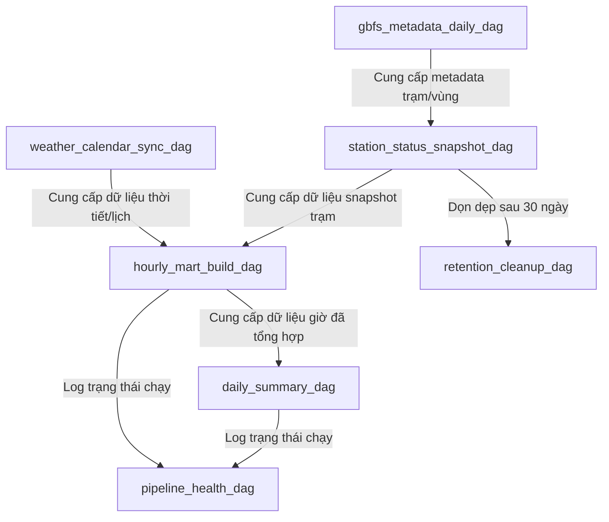

# Thiết kế Luồng Điều phối DAG (DAG Design & Orchestration)

Tài liệu này đặc tả chi tiết 8 luồng công việc tự động (DAGs) điều phối bởi Apache Airflow để chạy toàn bộ hệ thống **Bike Sharing Operation Intelligence**.

---

## 1. Danh sách chi tiết các DAGs

### 1.1. `gbfs_metadata_daily_dag`
* **Tần suất chạy**: Hàng ngày (Daily, lúc 00:05 UTC).
* **Mục đích**: Thu thập và cập nhật thông tin cấu hình hệ thống, khu vực địa lý, các loại xe và vị trí cố định của các trạm.
* **Quy trình nhiệm vụ (Task Flow)**:
  1. `extract_gbfs_metadata`: Gửi request kéo 4 endpoint GBFS (`system_information`, `system_regions`, `vehicle_types`, `station_information`).
  2. `load_raw_metadata`: Ghi nhận dữ liệu thô JSON vào bảng `raw.gbfs_feed_snapshots`.
  3. `transform_staging_metadata`: Parse dữ liệu JSON, tách thành các bảng `staging.system_information`, `staging.regions`, `staging.vehicle_types`, `staging.stations`.
  4. `dq_check_metadata`: Thực hiện kiểm tra chất lượng dữ liệu (vị trí tọa độ hợp lệ, không trùng lặp trạm, sức chứa không âm).
  5. `update_metadata_watermark`: Cập nhật dấu mốc thời gian hoàn tất.

### 1.2. `station_status_snapshot_dag`
* **Tần suất chạy**: Mỗi 15 phút một lần (`*/15 * * * *`).
* **Mục đích**: Thu thập trạng thái động (số lượng xe, số lượng dock khả dụng) thực tế tại các trạm để tạo chuỗi dữ liệu lịch sử.
* **Quy trình nhiệm vụ (Task Flow)**:
  1. `extract_station_status`: Kéo dữ liệu từ endpoint `station_status`.
  2. `load_raw_status`: Lưu snapshot JSON thô vào bảng `raw.station_status_snapshots`.
  3. `transform_staging_status`: Trích xuất thông tin trạng thái trạm vào bảng `staging.station_status`.
  4. `parse_vehicle_type_status`: Phân tách breakdown số lượng xe khả dụng theo loại vào bảng `staging.station_vehicle_type_status`.
  5. `dq_check_status`: Kiểm tra tính nhất quán (tổng số xe và dock trống không vượt quá capacity cộng sai số, không bị null khóa chính).
  6. `update_status_watermark`: Ghi nhận phiên chạy thành công.

### 1.3. `hourly_mart_build_dag`
* **Tần suất chạy**: Hàng giờ (Hourly, vào phút thứ 05 của giờ tiếp theo, e.g. 14:05 chạy cho dữ liệu khung giờ 13:00 - 14:00).
* **Mục đích**: Tổng hợp dữ liệu snapshot 15 phút thành các chỉ số giờ và sinh các khuyến nghị vận hành, cảnh báo, bất thường.
* **Quy trình nhiệm vụ (Task Flow)**:
  1. `resolve_target_hour`: Xác định khung giờ cần xử lý.
  2. `check_snapshot_completeness`: Kiểm tra xem tầng Staging đã có đủ tối thiểu 4 snapshot trong giờ đó chưa. Nếu thiếu, gửi cảnh báo.
  3. `clear_old_hourly_partition`: Chạy câu lệnh xóa dữ liệu cũ của giờ đó trong tầng Mart để đảm bảo tính **Idempotency** (chạy lại nhiều lần không sinh dữ liệu lặp).
  4. `build_hourly_station_availability`: Tính toán trung bình, min, max xe/dock trống và các tỷ lệ empty/full/unavailable rate, xác định `availability_level` và lưu vào bảng `mart.hourly_station_availability`.
  5. `build_hourly_region_availability` & `build_vehicle_type_summary` & `build_station_demand_ranking`: Chạy song song để tổng hợp dữ liệu theo vùng, loại phương tiện và tính toán `demand_score` để xếp hạng các trạm.
  6. `run_anomaly_detection`: Phân tích dữ liệu giờ để phát hiện các trạm bất thường (ví dụ: mất kết nối dữ liệu, hết xe quá lâu).
  7. `run_alert_generator`: Sinh ra các cảnh báo tức thời `mart.station_alerts` phục vụ hiển thị.
  8. `run_rebalancing_recommendations`: Chạy logic gợi ý chuyển xe từ trạm thừa sang trạm thiếu.
  9. `dq_check_hourly_mart`: Kiểm tra chất lượng dữ liệu đầu ra của Mart.
  10. `clear_api_cache`: Gọi API FastAPI để xóa cache cũ của khung giờ vừa được tính toán lại.

### 1.4. `daily_summary_dag`
* **Tần suất chạy**: Hàng ngày (Daily, lúc 01:00 UTC).
* **Mục đích**: Tổng kết dữ liệu ngày hôm trước từ tầng Hourly Mart.
* **Quy trình nhiệm vụ (Task Flow)**:
  1. `resolve_target_date`: Xác định ngày cần tổng kết.
  2. `check_hourly_mart_completeness`: Đảm bảo đủ 24 giờ của ngày hôm đó đã được build ở Hourly Mart.
  3. `clear_old_daily_partition`: Dọn dẹp phân vùng ngày cũ ở Daily Mart.
  4. `build_daily_station_summary` & `build_daily_region_summary` & `build_weather_mobility_summary`: Tổng hợp báo cáo ngày cho trạm, vùng, và tương quan thời tiết.
  5. `dq_check_daily_mart`: Thực hiện kiểm tra chất lượng dữ liệu.

### 1.5. `weather_calendar_sync_dag`
* **Tần suất chạy**: Mỗi 3 giờ một lần (`0 */3 * * *`).
* **Mục đích**: Thu thập dữ liệu thời tiết thực tế và cập nhật dữ liệu lịch trình làm việc.
* **Quy trình nhiệm vụ (Task Flow)**:
  1. `extract_weather_api`: Gọi API Open-Meteo hoặc dịch vụ thời tiết để lấy dữ liệu thực tế 3 giờ qua.
  2. `load_raw_weather`: Lưu vào `raw.weather_hourly`.
  3. `transform_staging_weather`: Lưu vào `staging.weather_hourly`.
  4. `load_calendar_csv`: Đọc file `data/input/calendar.csv` và đồng bộ vào `staging.calendar`.
  5. `dq_check_enrichment`: Kiểm tra các trường dữ liệu thời tiết và lịch trình không bị null bất thường.

### 1.6. `backfill_mart_dag`
* **Tần suất chạy**: Chạy thủ công (Manual).
* **Mục đích**: Tính toán lại toàn bộ dữ liệu Mart trong quá khứ khi có thay đổi trong công thức tính toán chỉ số (ví dụ: thay đổi hệ số tính `demand_score` hoặc đổi định nghĩa risk).
* **Quy trình nhiệm vụ (Task Flow)**:
  1. `validate_backfill_params`: Kiểm tra khoảng thời gian backfill hợp lệ.
  2. `check_source_staging_data`: Đảm bảo dữ liệu Staging trong khoảng thời gian đó tồn tại đầy đủ.
  3. `clear_mart_partitions`: Drop các phân vùng Mart trong khoảng thời gian chỉ định.
  4. `rebuild_hourly_mart_range`: Chạy vòng lặp để rebuild Hourly Mart theo ngày/giờ.
  5. `rebuild_daily_mart_range`: Rebuild Daily Mart tương ứng.
  6. `write_backfill_log`: Lưu lịch sử chạy backfill phục vụ giám sát.

### 1.7. `pipeline_health_dag`
* **Tần suất chạy**: Hàng ngày (Daily, lúc 02:00 UTC).
* **Mục đích**: Tổng kết và kiểm tra sức khỏe của toàn bộ hệ thống xử lý dữ liệu.
* **Quy trình nhiệm vụ (Task Flow)**:
  1. `check_airflow_dag_runs`: Quét lịch sử chạy của tất cả các DAG khác trong ngày.
  2. `check_data_freshness`: Tính toán độ trễ lớn nhất của dữ liệu trạm gần nhất so với giờ hiện tại.
  3. `check_dq_failures`: Thống kê số lượng lỗi kiểm tra chất lượng dữ liệu xảy ra trong ngày.
  4. `write_health_summary`: Ghi dữ liệu tổng hợp vào bảng `etl_metadata.pipeline_health_summary` để FastAPI phục vụ cho API giám sát.

### 1.8. `retention_cleanup_dag`
* **Tần suất chạy**: Hàng tuần (Weekly, vào lúc 03:00 Chủ Nhật).
* **Mục đích**: Giải phóng dung lượng ổ đĩa bằng cách xóa dữ liệu thô và dữ liệu staging tạm thời đã quá cũ (ví dụ: giữ lại dữ liệu raw và staging trong 30 ngày gần nhất, còn dữ liệu Mart được giữ vô thời hạn để phục vụ báo cáo lâu dài).
* **Quy trình nhiệm vụ (Task Flow)**:
  1. `delete_old_raw_data`: Xóa các bản ghi cũ trong `raw.station_status_snapshots` quá 30 ngày.
  2. `delete_old_staging_data`: Xóa các bản ghi cũ trong `staging.station_status` quá 30 ngày.
  3. `delete_old_metadata_logs`: Dọn dẹp logs chạy Airflow cũ.
  4. `vacuum_analyze_tables`: Chạy lệnh `VACUUM ANALYZE` trên PostgreSQL để dọn dẹp các tuple rác vật lý và cập nhật lại chỉ mục thống kê truy vấn tối ưu cho Database.
  5. `write_cleanup_log`: Ghi nhận nhật ký dọn dẹp.

---

## 2. Bản đồ phụ thuộc dữ liệu (Data Dependency Map)

